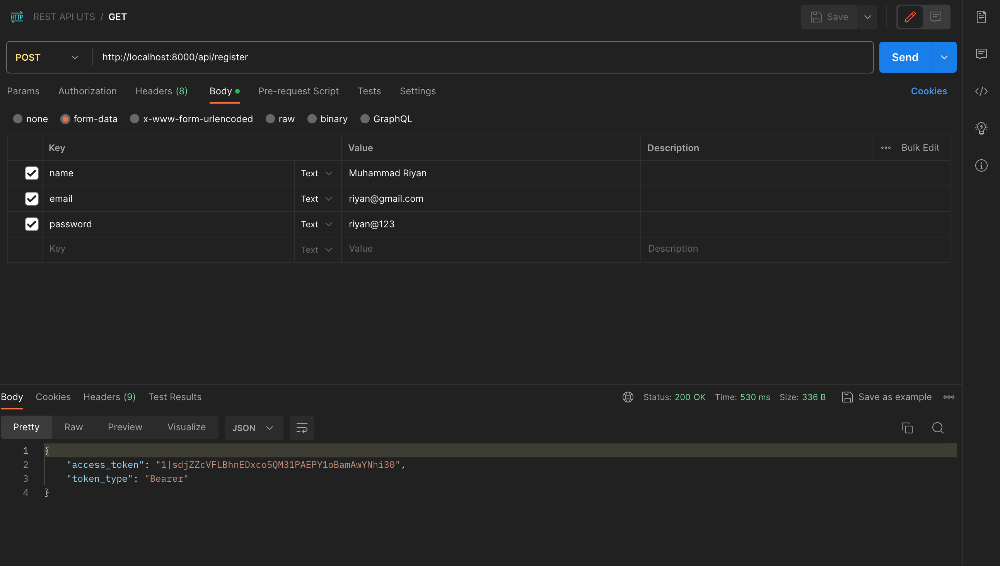

# Event Management system - EMS

A Event Management system

Install NPM dependencies:

```sh
npm install
```

Run the NPM server:

```sh
npm run serve
```

## Front end libs/packages and tech stacks

- [Vue 3](https://v3.vuejs.org/) (JS FE library)
- [bootstrap](https://getbootstrap.com/) (for responsive layout)
- [Vuesax](https://vuesax.com/) (UI controls library)
- [boxicons](https://boxicons.com/) (for icons)
- [VueX](https://vuex.vuejs.org/) (State management for user authentication)
- [Axios](https://www.npmjs.com/package/axios) (handling api requests)

## Test on Browsers

open http://localhost:8080/ and login with seeded user

# `Postman Snapshot`


